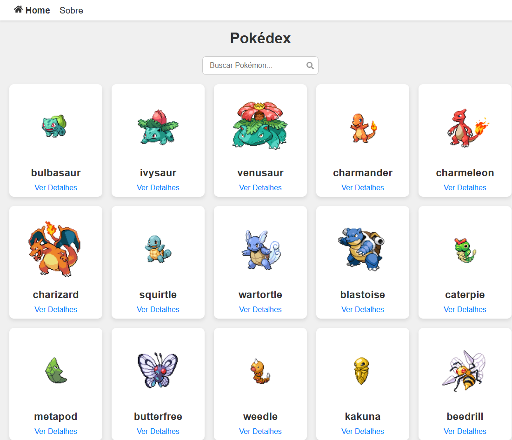
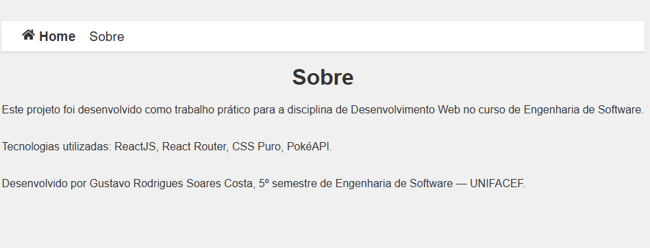
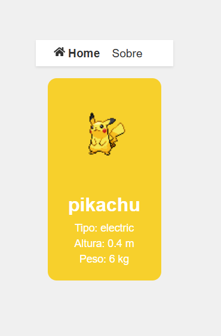

#link para a aplicação
- https://trabalho-web-marcio.vercel.app/

# 🧩 Trabalho Web - Pokédex React

Este projeto foi desenvolvido como trabalho prático da disciplina de Desenvolvimento Web no 5º semestre do curso de Engenharia de Software da UNIFACEF.  
A aplicação simula uma Pokédex online, permitindo visualizar informações de Pokémons consumidas diretamente da API pública [PokeAPI](https://pokeapi.co/).

---

## 📚 Tecnologias Utilizadas

- **[React](https://reactjs.org/)** - Biblioteca JavaScript para criação de interfaces de usuário.
- **[Vite](https://vitejs.dev/)** - Build tool para desenvolvimento rápido de aplicações React.
- **[React Router DOM](https://reactrouter.com/)** - Biblioteca de roteamento para React.
- **[CSS Puro](https://developer.mozilla.org/en-US/docs/Web/CSS)** - Estilização customizada sem frameworks externos.
- **[PokeAPI](https://pokeapi.co/)** - API pública de dados sobre Pokémons.

---

## Imagens do Projeto




---

## 🎯 Funcionalidades

- ✅ **Listagem de Pokémons**: Buscando informações diretamente da PokeAPI.
- ✅ **Página de Detalhes Dinâmica**: Cada Pokémon possui uma página própria utilizando rotas dinâmicas.
- ✅ **Sistema de Busca (SearchBar)**: Pesquisa Pokémons por nome em tempo real.
- ✅ **Tema Dinâmico por Tipo**: A cor de fundo da caixa do Pokémon muda conforme seu tipo principal (ex.: fogo, água, grama).
- ✅ **Página Sobre**: Explicando sobre o projeto e a tecnologia utilizada.
- ✅ **Design Responsivo**: Adaptado para diferentes tamanhos de tela.
- ✅ **Aplicação Online**: Publicada e acessível por link (em breve).

---

## 🚀 Como Rodar o Projeto Localmente

### 1. Clone o repositório

```bash
git clone https://github.com/gustavorsc/Trabalho_WEB_Marcio.git
